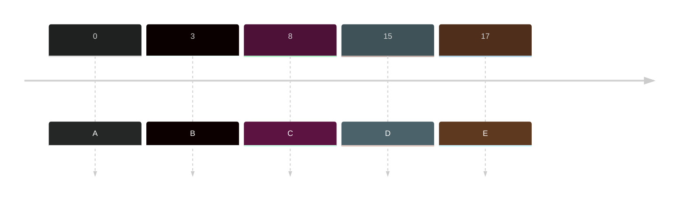
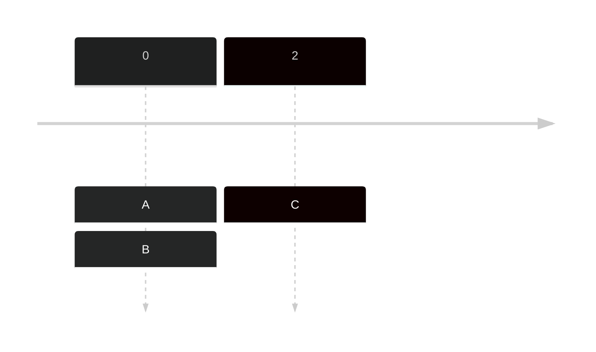
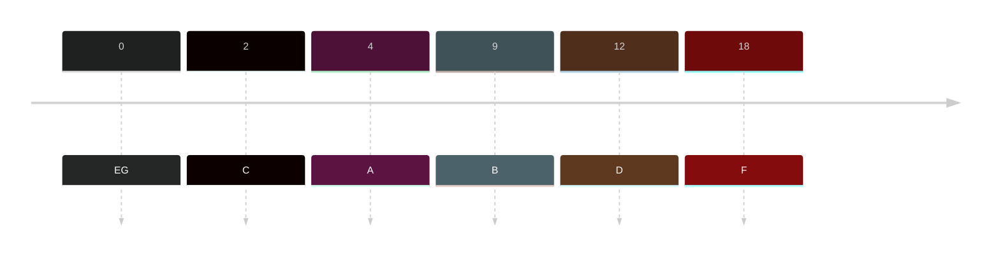
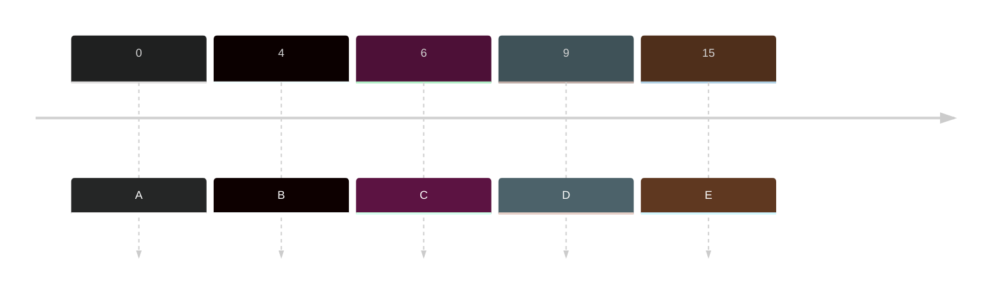
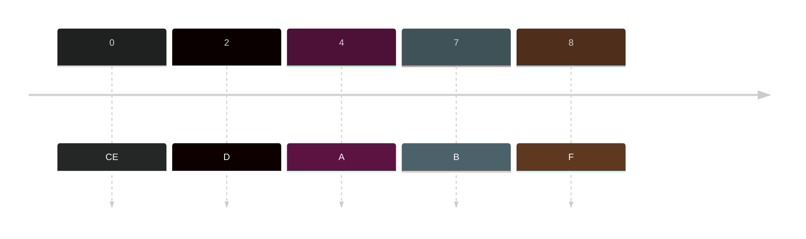
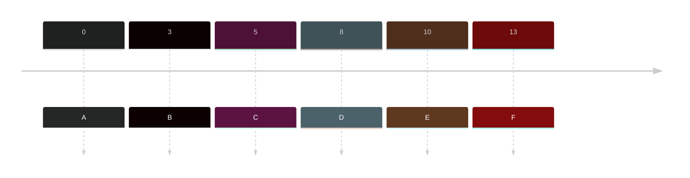
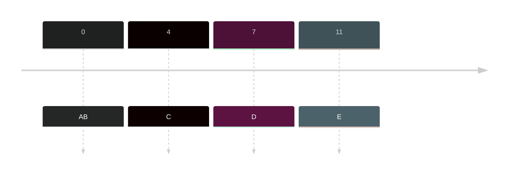

- A process of scheduling that could be preemptive or non-preemptive

> The algorithms below will just utilize a preemptive process

#### Timeline
- Sequence of job arrival time
- Arrival of each job

#### Gantt Chart
- Constructed to identify the sequence of jobs.

## First Come First Served (FCFS)
- The queue is based on arrival time (one at a time)

### Sample

|Jobs | Arrival time| Burst Time| Turnaround Time (ET - AT = TT) | Waiting Time (TT - BT = WT)|
|---|---|---|---|---|
|A| 0| 13| 13-0 = 13| 13-13= 0 |
|B|3|5| 18-3 = 15| 15-5 = 10|
|C| 8|4|22-8=14|14-14=0|
|D| 15 | 6| 27-15=13|13-6 = 7|
|E | 17|9|37 - 17 = 20| 20-9 = 11|

**Arrival Time** - Check whether who's first
**Burst Time** - How long OS will process the job
**Turnaround Time** - How long is the process
**Waiting Time** - How long it wait to start.

Timeline: 

Gantt Chart

| | | | | |
|---|---|---|---|---|
|A13|B5|C4|D6|E9|

![[Pasted image 20231008000438.png]]

Ex:

|Jobs | Arrival time| Burst Time| Turnaround Time (ET - AT = TT) | Waiting Time (TT - BT = WT)|
|---|---|---|---|---|
|A| 9| 9|20-9=11|11-9=2|
|B|13|11|31-13=18|18-11=7|
|C|5 |2 | 11-5=6| 6-2=4|
|D|2|7|9-2=7|7-7=0|
|E|0|1|1-0=1|1-1=0|
|F|22|5|36-22=14|14-5=9|

Timeline

Gantt Chart:
![[Pasted image 20231008001217.png]]

|Jobs | Arrival time| Burst Time| Turnaround Time (ET - AT = TT) | Waiting Time (TT - BT = WT)|
|---|---|---|---|---|
|A|0|4|4-0=4|4-4=0|
|B|0|2|6-0=6|6-2=4|
|C|2|7|13-2=11|11-7=4|

>Note: Once jobs have similar arrival time, look on the sequence of Jobs.

Timeline

Gantt Chart

![[Pasted image 20231008001704.png]]

## Shortest Job First (SJF)
- Who came with shortest burst will prioritize to run first
- Shortest burst = prioritize on queue

### Sample

|Jobs | Arrival time| Burst Time| Turnaround Time (ET - AT = TT) | Waiting Time (TT - BT = WT)|
|---|---|---|---|---|
|A|0|13|13-0=13|13-13=0|
|B|3|5|22-3=19|19-5=14|
|C|8|4|17-8=9|9-4=5|
|D|15|6|28-15=13|13-6=7|
|E|17|9|37-17=20|20-9=11|

Timeline:

Gantt Chart:
![[Pasted image 20231008002133.png]]

### Sample 2
|Jobs | Arrival time| Burst Time| Turnaround Time (ET - AT = TT) | Waiting Time (TT - BT = WT)|
|---|---|---|---|---|
|A|4|7|14-4=10|10-7=3|
|B|9|9|34-9=25|25-9=16|
|C|2|2|7-2=5|5-2=3|
|D|12|1|15-12=3|3-1=2|
|E|0|8|23-0=23|23-8=15|
|F|18|2|25-18=7|7-2=5|
|G|0|5|5-0=5|5-5=0|

Timeline:

Gantt Chart:
![[Pasted image 20231008002554.png]]

## NonPreemptive Priority (NPP)
- This looks at priority then on the arrival
- Then it will look at the burst time having the lowest original

### Sample
|Jobs | Arrival time| Priority|Burst Time| Turnaround Time (ET - AT = TT) | Waiting Time (TT - BT = WT)|
|---|---|---|---|---|--|
|A|0|6|3|6-0=6|6-6=0|
|B|4|3|2|15-4=11|11-3=8|
|C|6|4|1|10-6=4|4-4=0|
|D|9|2|1|12-6=6|6-2=4|
|E|15|2|1|17-15=2|2-2=0|

Timeline:

Gantt Chart
![[Pasted image 20231014222857.png]]

### Sample 2
|Jobs | Arrival time| Priority|Burst Time| Turnaround Time (ET - AT = TT) | Waiting Time (TT - BT = WT)|
|---|---|---|---|---|--|
|A|4|2|3|7-4=3|3-2=1|
|B|7|5|2|12-7=5|5-5=0|
|C|0|8|4|24-0=24|24-88=16|
|D|2|2|3|8-2=6|6-2=4|
|E|0|3|1|3-0=3|3-3=0|
|F|8|4|1|16-8=8|8-4=4|

Timeline:

Gantt Chart:
![[Pasted image 20231014223238.png]]

## Preemptive Priority
- Algorithm that will stop as a new jobs arrived and assess the priority 
- If priority is the same, check the **lowest original burst time**
- If they have same **lowest original burst time**, then look at **the first arrival time** and then the sequence of the jobs.

### Sample
|Jobs | Arrival time| Priority|Burst Time| Turnaround Time (ET - AT = TT) | Waiting Time (TT - BT = WT)|
|---|---|---|---|---|--|
|A|0|7|3|28-0=28|28-7=21|
|B|3|5|2|21-3=18|18-5=13|
|C|5|7|1|18-5=13|13-7=6|
|D|8|3|3|24-8=16|16-3=13|
|E| 10|4|1|16-10=6|6-4=2|
|F|13|2|1|15-13=2|2-2=0|

Timeline:

Gantt Chart:
![[Pasted image 20231014223843.png]]

### Sample 2
|Jobs | Arrival time| Priority|Burst Time| Turnaround Time (ET - AT = TT) | Waiting Time (TT - BT = WT)|
|---|---|---|---|---|--|
|A|0|4|3|19-0=19|19-4=5|
|B|0|5|1|5-0=5|5-5=0|
|C|4|7|1|14-4=10|10-7=3|
|D|7|1|2|15-7=8|8-1=7|
|E|11|2|1|13-11=2|2-2=0|

Timeline:

Gantt Chart:
![[Pasted image 20231014224122.png]]