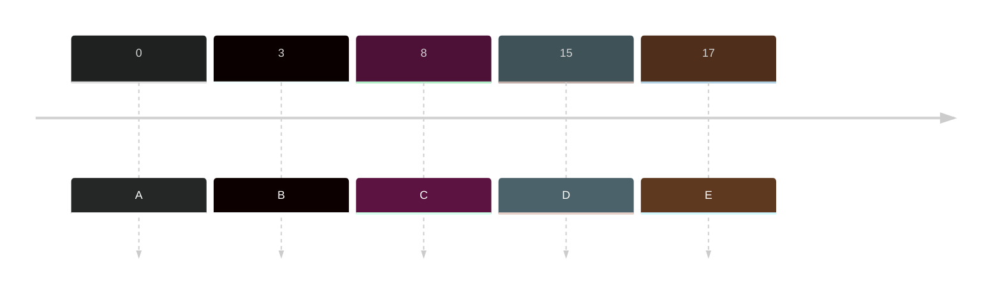
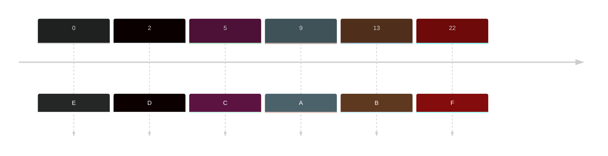
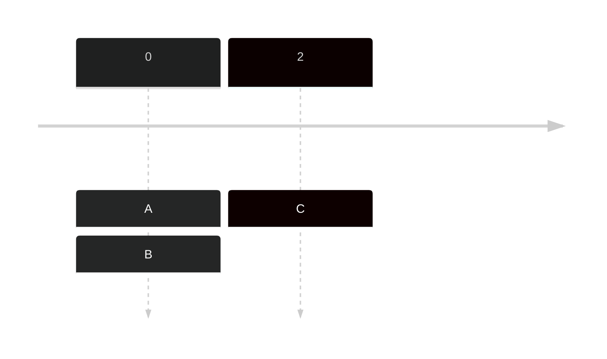

- The queue is based on arrival time (one at a time)

### Sample

|Jobs | Arrival time| Burst Time| Turnaround Time (ET - AT = TT) | Waiting Time (TT - BT = WT)|
|---|---|---|---|---|
|A| 0| 13| 13-0 = 13| 13-13= 0 |
|B|3|5| 18-3 = 15| 15-5 = 10|
|C| 8|4|22-8=14|14-14=0|
|D| 15 | 6| 27-15=13|13-6 = 7|
|E | 17|9|37 - 17 = 20| 20-9 = 11|

**Arrival Time** - Check whether who's first
**Burst Time** - How long OS will process the job
**Turnaround Time** - How long is the process
**Waiting Time** - How long it wait to start.

Timeline: 

Gantt Chart

| | | | | |
|---|---|---|---|---|
|A13|B5|C4|D6|E9|

![[Pasted image 20231008000438.png]]

Ex:

|Jobs | Arrival time| Burst Time| Turnaround Time (ET - AT = TT) | Waiting Time (TT - BT = WT)|
|---|---|---|---|---|
|A| 9| 9|20-9=11|11-9=2|
|B|13|11|31-13=18|18-11=7|
|C|5 |2 | 11-5=6| 6-2=4|
|D|2|7|9-2=7|7-7=0|
|E|0|1|1-0=1|1-1=0|
|F|22|5|36-22=14|14-5=9|

Timeline

Gantt Chart:
![[Pasted image 20231008001217.png]]

|Jobs | Arrival time| Burst Time| Turnaround Time (ET - AT = TT) | Waiting Time (TT - BT = WT)|
|---|---|---|---|---|
|A|0|4|4-0=4|4-4=0|
|B|0|2|6-0=6|6-2=4|
|C|2|7|13-2=11|11-7=4|

>Note: Once jobs have similar arrival time, look on the sequence of Jobs.

Timeline

Gantt Chart

![[Pasted image 20231008001704.png]]
