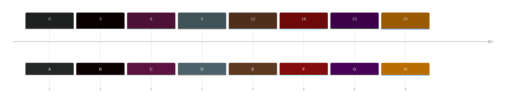
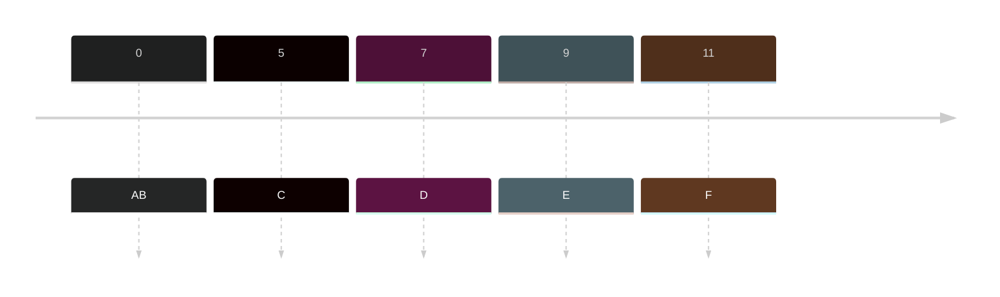

- According to the priority of process, processes are places in different queues. 
- Generally high priority processes are placed in the top level queue. Online after completion of processes from top level queue, lower level queued processes are scheduled.

>Need to update the TAT and WT
## Sample
|Jobs | Arrival time|Burst Time|Priority| Q-Level |Turnaround Time (ET - AT = TT) | Waiting Time (TT - BT = WT)|
|---|---|---|---|---|--|--|
|A|0|6|1|3|6-0= 6|6-6= 0|
|B|3|8|3|1|45-3= 42|42-8= 34|
|C|6|6|1|1|12-6= 6|6-6= 0|
|D|8|4|2|3|37-8= 29|29-4= 25|
|E|12|8|1|3|20-12= 8|8-8= 0|
|F|18|5|3|2|25-18= 7|7-5= 2|
|G|23|5|2|2|30-23= 7|7-5= 2|
|H|25|3|1|3|33-25= 8|8-3= 5|

Timeline:

**Q-Level**
Level 1 -> LOW -> SJF
Level 2 -> HIGH -> FCFS
Level 3 -> MEDIUM -> NPP

**Gantt Chart**
![[signal-2023-11-05-232627_002.jpeg]]

### Sample 2
|Jobs | Arrival time|Burst Time|Priority| Q-Level |Turnaround Time (ET - AT = TT) | Waiting Time (TT - BT = WT)|
|---|---|---|---|---|--|--|
|A|0|6|2|1|28-0= 28|28-6= 22|
|B|0|6|2|3|6-0= 6|6-6= 0|
|C|5|7|3|1|35-5= 30|30-7= 23|
|D|7|8|1|1|23-7= 16|16-8= 8|
|E|9|5|2|3|14-9= 5|5-5= 0|
|F|11|3|1|2|17-11= 6|6-3= 3|

Timeline:

**Q-Level**
Level 1 -> LOW -> PEP
Level 2 -> HIGH -> NPP
Level 3 -> MEDIUM -> SJF

**Gantt Chart**
![[signal-2023-11-06-210517_002.jpeg]]