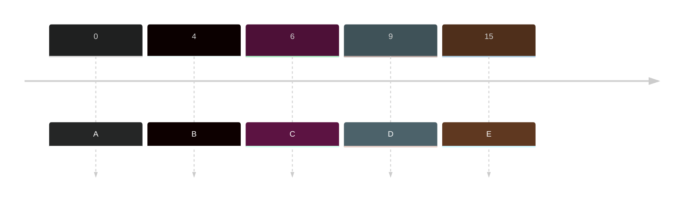
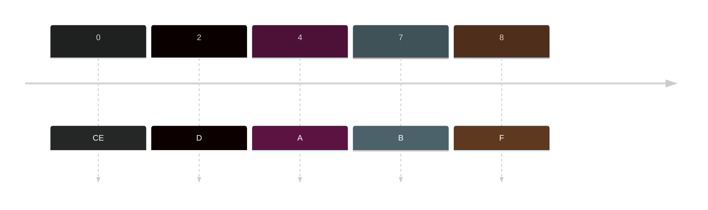

Non-preemptive Priority (NPP) adds a new column to look at, the **priority** column which tells what to do first being the lowest value as highest priority and having higher value to be a lower priority.

- This looks at priority then on the arrival
- Then it will look at the burst time having the lowest original

### Sample
|Jobs | Arrival time|Burst Time| Priority| Turnaround Time (ET - AT = TT) | Waiting Time (TT - BT = WT)|
|---|---|---|---|---|--|
|A|0|6|3|6-0=6|6-6=0|
|B|4|3|2|15-4=11|11-3=8|
|C|6|4|1|10-6=4|4-4=0|
|D|9|2|1|12-6=6|6-2=4|
|E|15|2|1|17-15=2|2-2=0|

Timeline:

Gantt Chart
![[Pasted image 20231014222857.png]]

 
### Sample 2
|Jobs | Arrival time|Burst Time| Priority| Turnaround Time (ET - AT = TT) | Waiting Time (TT - BT = WT)|
|---|---|---|---|---|--|
|A|4|2|3|7-4=3|3-2=1|
|B|7|5|2|12-7=5|5-5=0|
|C|0|8|4|24-0=24|24-88=16|
|D|2|2|3|8-2=6|6-2=4|
|E|0|3|1|3-0=3|3-3=0|
|F|8|4|1|16-8=8|8-4=4|

Timeline:

Gantt Chart:
![[Pasted image 20231014223238.png]]
