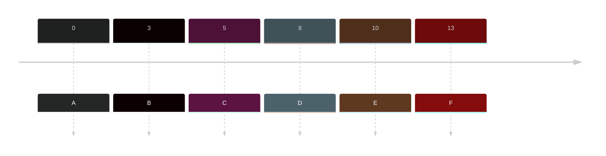
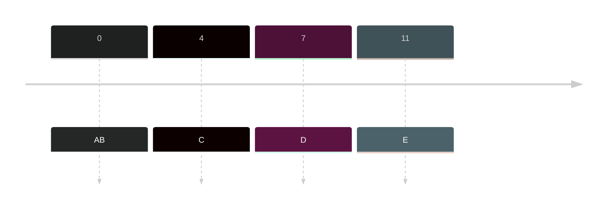

Similar to [[Non-Preemptive Priority]] but instead of finish the jobs all at once, it will need to take a look at every job that arrive, put them into the waiting queue and pick which one to process based on their priority.

- Algorithm that will stop as a new jobs arrived and assess the priority 
- If priority is the same, check the **lowest original burst time**
- If they have same **lowest original burst time**, then look at **the first arrival time** and then the sequence of the jobs.

### Sample
|Jobs | Arrival time|Burst Time|Priority| Turnaround Time (ET - AT = TT) | Waiting Time (TT - BT = WT)|
|---|---|---|---|---|--|
|A|0|7|3|28-0=28|28-7=21|
|B|3|5|2|21-3=18|18-5=13|
|C|5|7|1|18-5=13|13-7=6|
|D|8|3|3|24-8=16|16-3=13|
|E| 10|4|1|16-10=6|6-4=2|
|F|13|2|1|15-13=2|2-2=0|

Timeline:

Gantt Chart:
![[Pasted image 20231014223843.png]]

### Sample 2
|Jobs | Arrival time|Burst Time| Priority| Turnaround Time (ET - AT = TT) | Waiting Time (TT - BT = WT)|
|---|---|---|---|---|--|
|A|0|4|3|19-0=19|19-4=5|
|B|0|5|1|5-0=5|5-5=0|
|C|4|7|1|14-4=10|10-7=3|
|D|7|1|2|15-7=8|8-1=7|
|E|11|2|1|13-11=2|2-2=0|

Timeline:

Gantt Chart:
![[Pasted image 20231014224122.png]]