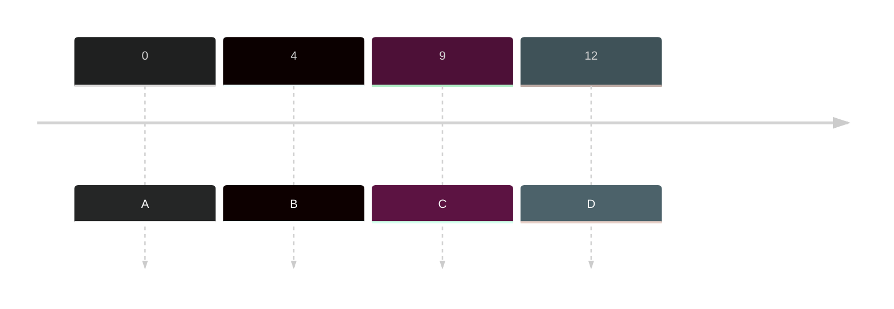

- A preemptive scheduling that give each process jobs to process at **specific time**.
- **Quantum time** - the specific time given in each **tier**
- There's a new system in this one, the **Tier System**

### Tier System
- The priority system of Round Robin
- It uses timeline to update which tier is the job now and using the **Quantum time** to guide how many time it should be process.

 -----TIER 1 -----> (Quantum time = 4)
 <----- TIER 2 ----- (Quantum time = 2)
 ----- TIER 3 ----->

## Sample
|Jobs |Arrival time|Burst Time| Turnaround Time (ET - AT = TT) | Waiting Time (TT - BT = WT)|
|---|---|---|---|---|--|
|A|0|12|30-0=30|30-12=18|
|B|4|10|34-4=30|30-10=20|
|C|9|8|36-9=27|27-8=19|
|D|12|10|40-12=28|28-10=18|

**Tier:**
 -----TIER 1 -----> (Quantum time = 4)
 <----- TIER 2 ----- (Quantum time = 2)
 ----- TIER 3 ----->

**Timeline:**

**Timeline w/ Tier System**
![[signal-2023-10-29-211410_002.jpeg]]

**Gantt Chart**
![[signal-2023-10-29-204013_003.jpeg]]