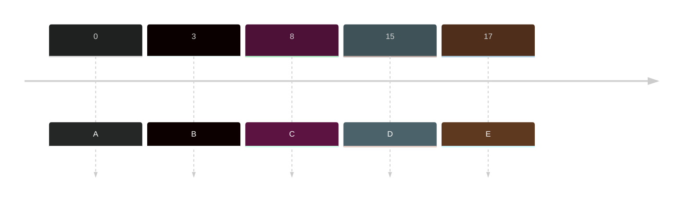
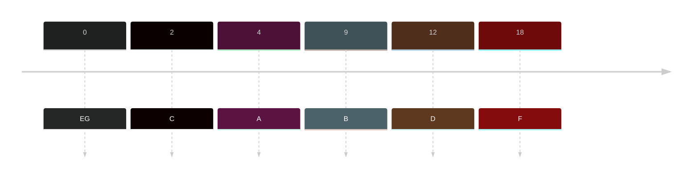

- Who came with shortest original burst will prioritize to run first
- Shortest burst = prioritize on queue

### Sample

|Jobs | Arrival time| Burst Time| Turnaround Time (ET - AT = TT) | Waiting Time (TT - BT = WT)|
|---|---|---|---|---|
|A|0|13|13-0=13|13-13=0|
|B|3|5|22-3=19|19-5=14|
|C|8|4|17-8=9|9-4=5|
|D|15|6|28-15=13|13-6=7|
|E|17|9|37-17=20|20-9=11|

Timeline:

Gantt Chart:
![[Pasted image 20231008002133.png]]

### Sample 2
|Jobs | Arrival time| Burst Time| Turnaround Time (ET - AT = TT) | Waiting Time (TT - BT = WT)|
|---|---|---|---|---|
|A|4|7|14-4=10|10-7=3|
|B|9|9|34-9=25|25-9=16|
|C|2|2|7-2=5|5-2=3|
|D|12|1|15-12=3|3-1=2|
|E|0|8|23-0=23|23-8=15|
|F|18|2|25-18=7|7-2=5|
|G|0|5|5-0=5|5-5=0|

Timeline:

Gantt Chart:
![[Pasted image 20231008002554.png]]

