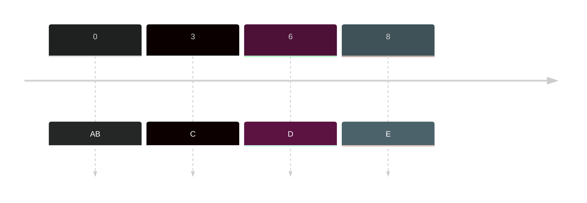
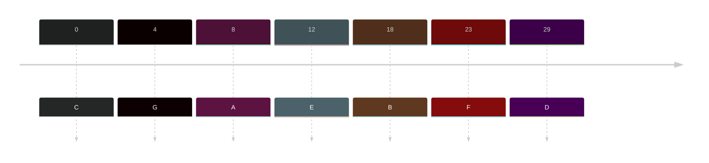

- Under of Preemptive Scheduling Algorithm
	- Which re-evaluate the arrival time
- Evaluates the remaining burst time
	- Unlike the preemptive priority which take a look at priority and the original burst time.

### Sample
|Jobs | Arrival time|Burst Time| Turnaround Time (ET - AT = TT) | Waiting Time (TT - BT = WT)|
|---|---|---|---|---|
|A|0|4|4-0=4|4-4=0|
|B|0|6|15-0=15|15-6=9|
|C|3|2|6-3=3|3-2=1|
|D|6|2|8-6=2|2-2=0|
|E|8|1|9-8=1|1-1=0|

**Timeline:**

**Gantt Chart:**
![[Pasted image 20231027111301.png]]

### Sample 2
|Jobs | Arrival time|Burst Time| Turnaround Time (ET - AT = TT) | Waiting Time (TT - BT = WT)|
|---|---|---|---|---|
|A|8|8|23-8=15|15-8=7|
|B|18|16|65-18=47|47-16=31|
|C|0|10|15-0=15|15-10=5|
|D|29|5|36-29=7|7-5=2|
|E|12|8|31-12=19|19-8=11|
|F|23|13|43-23=26|26-13=13|
|G|4|5|9-4=5|5-5=0|

**Timeline:**

**Gantt Chart:**
![[Pasted image 20231027112607.png]]
> Need to update to have clean version